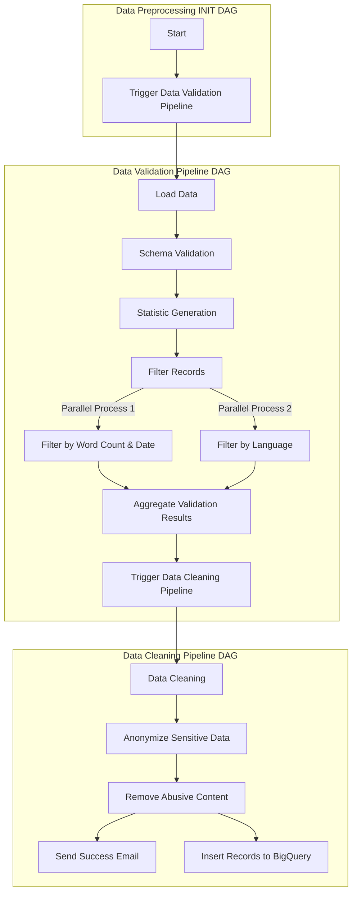

# Automated-BiLingual-Complaint-System


## Project Setup

### Prerequisites
- Ensure you have **Docker** installed.
- Ensure you have **Visual Studio Code** installed.
- Allocate sufficient resources to Docker (e.g., memory, CPU) to ensure the project runs smoothly.

### Step-by-Step Guide

#### Step 1: Clone the Repository
Clone the repository to your local machine and navigate into the project directory:
```bash
git clone https://github.com/rajpandeygithub/Automated-BiLingual-Complaint-System.git
cd Automated-BiLingual-Complaint-System
```

#### Step 2: Open the Project in Visual Studio Code
Open the project folder (`Automated-BiLingual-Complaint-System`) in **Visual Studio Code**.

#### Step 3: Initialize and Start Docker Containers
**Note: All necessary libraries are listed in the `requirements.txt` file, making it easy to install dependencies automatically. This file is also used in the `docker-compose.yaml` setup to ensure all dependencies are installed when running the project.**

Run the following commands in your Visual Studio Code terminal to initialize and start the Docker containers for Airflow:

1. Initialize Airflow:
   ```bash
   docker compose up airflow-init
   ```
2. Start all containers:
   ```bash
   docker compose up
   ```

#### Step 4: Access the Airflow Web Interface
Once the containers are up and running, open your browser and go to:
```
http://localhost:8080/home
```
Login with default username password:

**Username: airflow2**

**Password: airflow2**

#### Step 5: Enable and Run DAGs
In the Airflow web interface:
1. Enable the toggles for all DAGs to activate them.
2. **First-time Setup**: If this is your first time running the DAGs, they should start automatically.


3. **Subsequent Runs**: If the DAGs have been run before, trigger the `Data_Preprocessing_INIT` DAG manually. This will initiate a sequence:
   - `Data_Preprocessing_INIT` will trigger `data_validation_trigger`, which will, in turn, trigger the `Data_Validation_Pipeline`.


#### Step 6: Shut Down Docker Containers
To stop and shut down the Docker containers, go to the **Visual Studio Code** terminal and run:
```bash
docker compose down
```

## Project Overview
This project implements an automated system for handling customer complaints in the banking domain. Leveraging machine learning, the system analyzes complaints submitted in two languages (English & Hindi), and categorizes them using two distinct classifiers. The first classifier identifies the banking product related to the complaint (e.g., credit card, loan, account services), while the second routes the complaint to the appropriate department for efficient resolution. This solution streamlines complaint management, enhances response times, and significantly improves customer satisfaction by ensuring complaints are swiftly directed to the relevant teams.

Key features include:
- Simplified UI for complaint submission.
- Support for two languages (English, & Hindi).
- Automatic classification of products and departments using machine learning.
- Agent assignment based on language proficiency and availability.


## Data Acquisition

We make use of the Consumer Complaint Database from Consumer Financial Protection Bureau (CFPB). This database compiles real-time U.S. consumer complaints regarding financial products and services. It includes data on consumer narratives (anonymized), banking products, and company responses, providing insight into financial sector issues.

For more information: [Link](https://www.consumerfinance.gov/data-research/consumer-complaints/) <br>
For API Access: [Link](https://cfpb.github.io/api/ccdb/api.html)

### Data Schema

| Attribute Name              | Description                                                                                   | Data Type |
|-----------------------------|-----------------------------------------------------------------------------------------------|-----------|
| `complaint_id`              | Unique identifier for each complaint                                                          | Integer     |
| `date_received`             | Date when CFPB received the complaint                                                          | Datetime      |
| `date_resolved`             | Date when the complaint was resolved by the bank                                                          | Integer      |
| `time_resolved_in_days`     | Duration in days taken to resolve the complaint by the bank                                               | Integer     |
| `complaint`                 | Consumer's answer to "what happened" from the complaint. Consumers must opt-in to share their narrative. The  narrative is not published unless the consumer consents, and consumers can opt-out at any time. The CFPB takes reasonable steps to scrub personal information from each complaint that could be used to identify the consumer.                                                    | String    |
| `complaint_hindi`           | Text content of the complaint (in Hindi)                                                      | String    |
| `product`                   | The type of product the consumer identified in the complaint                       | String    |
| `department`                | The department responsible for handling the complaint                                         | String    |
| `sub_product`               | The type of sub-product the consumer identified in the complaint                                       | String    |
| `issue`                     | The issue the consumer identified in the complain                                                            | String    |
| `sub_issue`                 | The sub-issue the consumer identified in the complaint                                                             | String    |
| `company`                   | Company associated with the complaint                                                         | String    |
| `state`                     | The state of the mailing address provided by the consumer                                                   | String    |
| `zipcode`                   | The mailing ZIP code provided by the consumer                                                    | String     |
| `company_response_consumer` | This is how the company responded. For example, "Closed with explanation"                                                     | String    |
| `consumer_consent_provided` | Identifies whether the consumer opted in to publish their complaint narrative. The narrative is not published unless the consumer consents and consumers can opt-out at any time                                     | String    |
| `submitted_via`             | How the complaint was submitted to the CFPB                          | String    |
| `date_sent_to_company`      | The date when CFPB sent the complaint to the company                                 | String    |
| `timely_response`           | Whether the company gave a timely response                                 | String    |
| `consumer_disputed`         | Whether the consumer disputed the company’s response                                     | String    |


## Data Preprocessing Pipeline

The preprocessing pipeline performs comprehensive data cleaning, filtering, and anonymization on the Consumer Complaint Database from Consumer Financial Protection Bureau (CFPB). The pipeline includes multiple stages to ensure data quality and privacy.

### Preprocessing Steps

### 1. Data Loading
- Loads the raw dataset from Google Cloud Storage
- Dataset format: Parquet

### 2. Basic Filtering
- Removes records with insufficient word count
- Filters records based on date range (March 19, 2015 to July 28, 2024)
- Converts date fields to proper date format

### 3. Language Detection
- Uses `fast_langdetect` (based on fast-text) for language identification
- Implements multi-threaded processing for improved performance
- Retains only English (EN) and Hindi (HI) complaints
- Removes records in other languages

### 4. Data Cleaning
- Converts complaint text to lowercase
- Removes special characters using regex
- Eliminates duplicate records based on:
  - Product
  - Sub-product
  - Complaint text
- Removes records with null values in critical fields:
  - Product
  - Sub-product
  - Department
  - Complaint text

### 5. Abusive Content Filtering
- Removes words from a set of abusive words
- Implements Bloom filter for abusive words set to efficient filter out abusive words
- Replaces abusive words with placeholder text
- Processes text while maintaining sentence structure

### 6. PII Data Anonymization
- Detects and masks personally identifiable information (PII)
- PII types handled:
  - Bank account numbers
  - Routing numbers
  - Credit card numbers (multiple formats)
  - Transaction dates
  - SSN/TIN numbers
  - EIN numbers
  - Passport numbers
  - Email addresses
  - Phone numbers
  - Home addresses
  - Demographic information (race, ethnicity, gender)
  - Transaction amounts

### 7. Data Aggregation
- Joins filtered datasets on complaint ID
- Selects and maintains relevant columns

### 8. Abusive Content Filtering
-	Removes words from a set of abusive words
-	Implements Bloom filter for efficient filtering
-	Replaces abusive words with placeholder text
-	Processes text while maintaining sentence structure

### 9. Success Email Trigger
- Once all the pipelines have successfully run, a success email is triggered to notify stakeholders of the pipeline completion

### 10. Slack Alerts Integration
- On every DAG success and failure, we trigger a slack notification a private channel in the MLOps workspace.


### Output
- Final preprocessed dataset saved in Parquet format
- Location: `data/preprocessed_dataset.parquet` and `bilingualcomplaint-system.MLOps.preprocessed_data`(BigQuery)
- Includes comprehensive logging of all preprocessing steps
- Send a pipeline success / failure email


### Pipeline Orchestration (Airflow DAGs)
Summarizing entire Airflow Orchestration Graph Below:



Summarizing the entire Airflow Orchestration Graph Below Using Dags:
   
   
   
   
   


## Tracking and Logging

Our pipeline includes detailed logging to track progress and identify issues about errors during data processing. We use Python's `logging` library to set up a custom logger that captures important information at each stage of the process.

### Key Features:
- **Progress Tracking**: Logs are generated at each stage of the pipeline, including all functions.
- **Error Monitoring**: Errors are logged with relevant details, making it easier to locate and fix issues quickly.
- **Custom Log Path**: All logs are saved in `logs/application_logs/preprocessing_log.txt` for easy access and troubleshooting.


## Data Versioning with DVC
- 1. DVC (Data Version Control) to manage and version control our datasets throughout the preprocessing pipeline
- 2. Raw data is loaded from Google Cloud Storage (GCS), processed and cleaned using our Airflow pipeline, and the preprocessed data is then stored back to 
- 3. Metadata versions are stored in GCS
     
 
  


## Pipeline Flow Optimization
- In Filter by Language task, Multi-threading was used to detect the language of the text in parallel. Before multi-threading the time to complete language detection was 3.43 seconds, and after multi-threading the execution time was reduced to 2.28 seconds.
- In Remove Abuse content task, we have a list of abusive words to remove. So to efficiently remove abusive words we made use of Bloom Filters. This reduced our execution time from 1.25 to 1.65 seconds.

Below is the Gantt chart illustrating the pipeline flow after optimization:

   
   
   
   
   
   
   
   
   
   
   


## Data Schema & Statistics Generation: 

Here's a high-level overview of what are the steps we do in the context of feeding quality data to the modelling stage.

### 1. Data Quality Assurance
- **Text Validation:** Perform several checks on consumer complaint narratives to ensure data quality, as the quality of data directly impacts the performance of text classification models. The following issues are validated:
   - Empty Entries: Checked for any entries that lack text.
   - Extremely Short or Long Complaints: Complaints that are too short or excessively long are flagged for review.
   - Non-ASCII Characters: Identified any characters that fall outside the standard ASCII range.

- **Interdependent Constraint Validation:** Checked for logical consistency between related fields. This step helps maintain the overall quality of the dataset by ensuring that related data points align correctly.

- **Categorical Data Validation:** Verified that categorical values (some of which serve as output labels) contain valid entries. This ensures that the model is trained on appropriate and meaningful labels.
  
### 2. Statistics Generation and Schema Analysis

- **Data Statistics Generation:** Generating comprehensive statistics from the DataFrame containing complaint data using TensorFlow Data Validation (TFDV). These statistics offer insights into the distribution and characteristics of the data, serving as a foundational reference for quality assessment.
  
- **Outlier Detection:** Identified unusually long complaints that could skew the classification model or indicate special cases needing separate handling.
  
- **Class Distribution Analysis:** Examined the distribution of complaints across different categories (e.g., products, issues). Understanding class imbalance is vital, as it may require techniques like oversampling or undersampling to ensure effective model training.

- **Temporal Analysis:** Analyzed yearly trends in complaint volumes and categories. This information can be leveraged to create time-based features and understand whether the classification model needs to account for temporal shifts in complaint patterns.

- **Duplicate Detection:** Identified repeated complaints to prevent data leakage and ensure that the classification model does not overfit to duplicated data.

- Finally, we remove `tags` and `company_response_public` columns as they had `99%` null values from TFDV library.

## Anomaly Detection & Alerts

Incorporated a comprehensive data quality assessment and anomaly detection process tailored for consumer complaint data ensuring that our data meets predefined quality standards. 

### 1. Anomaly Detection

- **Schema Inference:** Inferred a schema from the generated statistics, defining the expected data structure, types, and constraints. This schema acts as a reference for validating incoming datasets against established business rules.
  
- **Anomaly Detection:** Checked for anomalies in the dataset by validating it against the inferred schema. It filters specific columns that we're interested in (e.g., complaint details, department, product) to focus on critical areas, logging any detected issues.


  
- **Anomaly Resolution:** To fix the detected anomalies, relaxed the minimum and maximum fraction constraints for values that must come from the domain for the features where anomalies were identified. This adjustment allowed us to accommodate legitimate data variations.

- **Schema Freezing:** Once the anomalies were fixed, inferred a schema that defined the expected data structure, types, and constraints. We then "froze" this schema and stored it in a file, creating a consistent reference point for validating incoming data when our application is released to the public. Freezing the schema is crucial as it ensures that any data processed in production adheres to the established rules and standards, helping us maintain high data quality and reliability.

### 2. Alerts

- **Alerts for Anomalies:** To ensure prompt communication, alerts were generated and sent via email whenever anomalies were detected in the data. This proactive approach allowed us to stay informed and address / fix potential anomalies swiftly.


  
## Data Bias Detection and Mitigation

The project routes customer complaints to the correct product and department based solely on complaint narratives, with demographic or personally identifiable information (PII) redacted to ensure privacy and mitigate demographic bias. This approach aligns with responsible ML fairness principles, ensuring that the model is not biased on demographic factors like location, gender, religion, ethnicity etc. 


### 1. Detecting Bias in Data: 
- We evaluate model fairness across complaint-related categories, focusing on product, department, to detect performance imbalances. We’ll record each type of bias discovered, the slice affected, and the metrics indicating bias. The bias mitigation technique will be documented with explanations, parameters used, any trade-offs and reasoning.
 
### 2. Data Slicing: 
- We will use Fairlearn's MetricFrame to define and evaluate slices of data once predictions are available. MetricFrame enables us to track performance across slices and detect bias by calculating metrics like accuracy etc for each slice. 

### 3. Bias Mitigation: 
If significant discrepancies appear across slices:
- Re-sampling Underrepresented Groups: If some slices have fewer instances, we’ll balance them by oversampling (duplicating underrepresented entries) or under-sampling (reducing overrepresented entries). 

- Once the ML model is built, fairness constraints through Fairlearn can be applied to optimize for balanced performance across slices, ensuring no slice disproportionately affects routing accuracy. 

- For certain slices, we may apply customized decision thresholds to improve performance for groups with historically lower accuracy.

## Preprocessing Module Unit Tests
- Unit tests have been developed to validate the functions in `preprocessing.py`, covering data loading, record filtering, language detection, abusive content removal, and data aggregation processes.
- These tests ensure correct data transformation and filtering logic is applied to meet preprocessing requirements.

## Experimentation

### Vertex AI
- The entire machine learning pipeline is orchestrated using Vertex AI Pipelines.
  
Key components of the pipeline include:
- Data Ingestion: Fetching data from BigQuery and preprocessing it.
- Model Training and Testing: Using XGBoost and Naive Bayes models for complaint classification.
- Model Selection and Registration: Choosing the best-performing model based on evaluation metrics and registering it in Vertex AI for deployment.


The **Automated BiLingual Complaint System** uses two models for classification tasks. 

### 1. mBERT Model
The mBERT model was used to classify complaints into appropriate **Departments** and **Products**, ensuring efficient complaint routing and resolution.

#### Department Classification
Classifies complaints into relevant organizational departments for faster resolution.  
- **Overall F1 Score**: 0.55  
- **Precision**: 0.62, **Recall**: 0.55  
- Departments with at least 468 complaints:
  - Fraud & Security  
  - Loans & Credit  
  - Payments & Transactions  
  - Customer Relations & Compliance  
  - Account Services  


#### Product Classification
Identifies the product category associated with a complaint for targeted handling.  
- **Overall F1 Score**: 0.69  
- **Precision**: 0.70, **Recall**: 0.69  
- Products with at least 681 complaints:
  - Credit/Debt Management & Repair Services  
  - Vehicle Loan  
  - Credit/Prepaid Card Services  
  - Money Transfers  
  - Mortgage  
  - Checking or Savings Account  


### Monitoring

The system leverages **Vertex AI Monitoring** for real-time tracking and visualization of key metrics, including:

- **Prediction Success Rates**: Monitors the success of department and product predictions.
- **Resource Utilization**: Tracks CPU and memory usage for deployed endpoints to ensure efficient operation.
- **Error Tracking**: Captures validation errors and anomalies for proactive troubleshooting.

Below is a snapshot of the monitoring dashboard:


## CI-CD

### a. Data Source

Data is fetched from Google Cloud BigQuery, with complaint_english as the primary feature and product as the target label. Preprocessing steps include TF-IDF Vectorization for text data transformation and Label Encoding for converting categorical labels into numerical format.


### b. Model

The pipeline implements two models:
	•	XGBoost: Optimized for high accuracy and performance.
	•	Naive Bayes: A lightweight, faster alternative suited for text classification tasks.
Both models are trained, tested, and compared for robust experimentation.

### c. Model Components

Key components of the pipeline include:
	1.	TF-IDF Vectorizer: Converts text into meaningful numerical representations.
	2.	Label Encoder: Encodes target labels for model compatibility.
	3.	Models:
	•	XGBoost: Gradient boosting algorithm for structured data.
	•	Naive Bayes: Probabilistic model for quick predictions.

### d. Model Evaluation

Models are evaluated using F1 Score, Precision, and Recall, ensuring a comprehensive assessment of performance. Evaluation results are logged in BigQuery for reference and comparison, while real-time updates on model evaluation are sent through Slack notifications.

### e. Model Deployment

The best-performing model is automatically registered and deployed to a Vertex AI real-time endpoint, supporting scalable, real-time inference. Vertex AI’s automated traffic splitting manages multiple model versions efficiently. Post-deployment, performance and drift detection are monitored continuously.

## Data Drift Detection

Data drift refers to changes in the statistical properties of data over time, which can affect the performance of machine learning models. To address this, we track data drift in the **Automated BiLingual Complaint System** using several methods:

- **Cosine Similarity Analysis**:  
  We compute the cosine similarity between embeddings of new complaint data and a reference dataset. If the similarity falls below a defined threshold, we detect drift.

- **Drift Records in BigQuery**:  
  Drift events are logged in a BigQuery table, capturing details like:
  - Timestamp of the event.
  - Complaint text in English and Hindi.
  - Product and department classifications.
  - Maximum cosine similarity score.

 

### f. Monitoring and Notifications
- Slack Integration: Sends real-time notifications for each pipeline execution stage, ensuring immediate updates on success or failure.
- BigQuery Tracking: Logs metrics and metadata, such as training duration, model performance, and record counts, for centralized analysis.

### g. Automation
- Pipeline Compilation: The entire machine learning workflow is compiled using Kubeflow and Vertex AI.
- End-to-End Automation: Submitting the pipeline to Vertex AI automates data preprocessing, model training, evaluation, registration, and deployment, streamlining the entire lifecycle.

### h. Bias Detection
- Implements checks for model bias by analyzing predictions across different subsets of data (e.g., categories, demographics, or product types) to ensure fairness.

### Model Pipeline:


### Model Registry:


### Cloud Run function:


## User Interaction

The **Customer Complaint Portal** allows users to submit complaints, validate inputs, and receive feedback about their concerns. Below is an example of the portal in action:

### 1. Homepage
The homepage provides a simple interface for users to begin submitting their complaints. Users are greeted with the title and a text area for input.


### 2. Complaint Submission
Users can type their complaints in the provided text area. For example, here's a complaint involving a credit card issue:


### 3. Complaint Resolution
After submitting, the system processes the complaint and assigns it to the relevant department or product owner. A success message is displayed along with the assignment details.


## Backend API

The backend of the **Bilingual Complaint Classification System** is powered by **FastAPI** and deployed on **Google Cloud Run**. It serves as the core processing engine for complaint classification, exposing endpoints for submitting complaints and predicting the relevant department and product.

### API Documentation
The API is documented using **OpenAPI** standards, providing an interactive interface for testing and exploring available endpoints. Below is a snapshot of the `/docs` page:


The key endpoints include:
- **GET `/ping`**: A health check endpoint to ensure the backend is running.
- **POST `/predict`**: Accepts a complaint and returns the predicted department and product classification.

## License Information

The Consumer Financial Protection Bureau (CFPB) data is open to the public under the OPEN Government Data Act, enabling transparency and broad accessibility. Users should follow privacy guidelines, particularly around any personally identifiable information (PII) within consumer data.

For further details, refer to the [CFPB Data Policy](https://www.consumerfinance.gov/data/).
