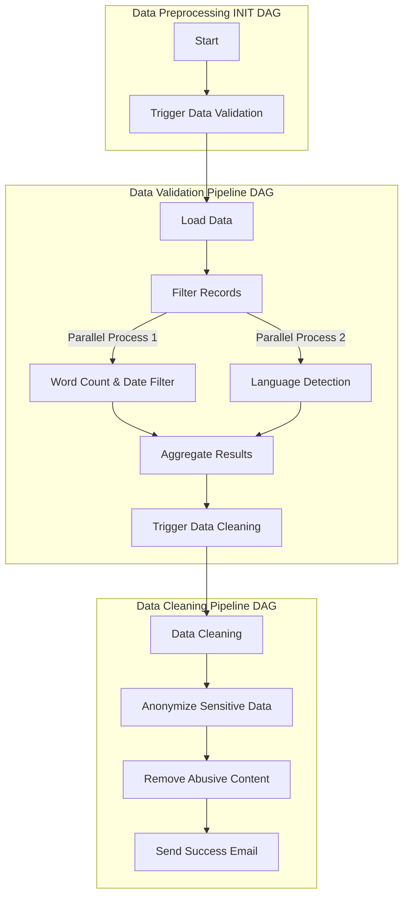

# Automated-BiLingual-Complaint-System


## Project Setup

### Prerequisites
- Ensure you have **Docker** installed.
- Ensure you have **Visual Studio Code** installed.
- Allocate sufficient resources to Docker (e.g., memory, CPU) to ensure the project runs smoothly.

### Step-by-Step Guide

#### Step 1: Clone the Repository
Clone the repository to your local machine and navigate into the project directory:
```bash
git clone https://github.com/rajpandeygithub/Automated-BiLingual-Complaint-System.git
cd Automated-BiLingual-Complaint-System
```

#### Step 2: Open the Project in Visual Studio Code
Open the project folder (`Automated-BiLingual-Complaint-System`) in **Visual Studio Code**.

#### Step 3: Initialize and Start Docker Containers
Run the following commands in your Visual Studio Code terminal to initialize and start the Docker containers for Airflow:

1. Initialize Airflow:
   ```bash
   docker compose up airflow-init
   ```
2. Start all containers:
   ```bash
   docker compose up
   ```

#### Step 4: Access the Airflow Web Interface
Once the containers are up and running, open your browser and go to:
```
http://localhost:8080/home
```

#### Step 5: Enable and Run DAGs
In the Airflow web interface:
1. Enable the toggles for all DAGs to activate them.
2. **First-time Setup**: If this is your first time running the DAGs, they should start automatically.


3. **Subsequent Runs**: If the DAGs have been run before, trigger the `Data_Preprocessing_INIT` DAG manually. This will initiate a sequence:
   - `Data_Preprocessing_INIT` will trigger `data_validation_trigger`, which will, in turn, trigger the `Data_Validation_Pipeline`.


#### Step 6: Shut Down Docker Containers
To stop and shut down the Docker containers, go to the **Visual Studio Code** terminal and run:
```bash
docker compose down
```

## Project Overview
This project implements an automated system for handling customer complaints in the banking domain. Leveraging machine learning, the system analyzes complaints submitted in two languages (English & Hindi), and categorizes them using two distinct classifiers. The first classifier identifies the banking product related to the complaint (e.g., credit card, loan, account services), while the second routes the complaint to the appropriate department for efficient resolution. This solution streamlines complaint management, enhances response times, and significantly improves customer satisfaction by ensuring complaints are swiftly directed to the relevant teams.

Key features include:
- Simplified UI for complaint submission.
- Support for two languages (English, & Hindi).
- Automatic classification of products and departments using machine learning.
- Agent assignment based on language proficiency and availability.


## Data Information

We make use of the Consumer Complaint Database from Consumer Financial Protection Bureau (CFPB). This database compiles real-time U.S. consumer complaints regarding financial products and services. It includes data on consumer narratives (anonymized), banking products, and company responses, providing insight into financial sector issues.

For more information: [Link](https://www.consumerfinance.gov/data-research/consumer-complaints/) <br>
For API Access: [Link](https://cfpb.github.io/api/ccdb/api.html)

### Data Schema

| Attribute Name              | Description                                                                                   | Data Type |
|-----------------------------|-----------------------------------------------------------------------------------------------|-----------|
| `complaint_id`              | Unique identifier for each complaint                                                          | Integer     |
| `date_received`             | Date when CFPB received the complaint                                                          | Datetime      |
| `date_resolved`             | Date when the complaint was resolved by the bank                                                          | Integer      |
| `time_resolved_in_days`     | Duration in days taken to resolve the complaint by the bank                                               | Integer     |
| `complaint`                 | Consumer's answer to "what happened" from the complaint. Consumers must opt-in to share their narrative. The  narrative is not published unless the consumer consents, and consumers can opt-out at any time. The CFPB takes reasonable steps to scrub personal information from each complaint that could be used to identify the consumer.                                                    | String    |
| `complaint_hindi`           | Text content of the complaint (in Hindi)                                                      | String    |
| `product`                   | The type of product the consumer identified in the complaint                       | String    |
| `department`                | The department responsible for handling the complaint                                         | String    |
| `sub_product`               | The type of sub-product the consumer identified in the complaint                                       | String    |
| `issue`                     | The issue the consumer identified in the complain                                                            | String    |
| `sub_issue`                 | The sub-issue the consumer identified in the complaint                                                             | String    |
| `company`                   | Company associated with the complaint                                                         | String    |
| `state`                     | The state of the mailing address provided by the consumer                                                   | String    |
| `zipcode`                   | The mailing ZIP code provided by the consumer                                                    | String    |
| `tags`                      | Complaints are tagged based on submitter details: those involving consumers aged 62+ are tagged “Older American,” while complaints from servicemembers or their families are tagged “Servicemember.” This category includes active duty, National Guard, Reservists, Veterans, and retirees.               | String    |
| `company_response_public`   | The company's optional, public-facing response to a consumer's complaint. Companies can choose to select a response from a pre-set list of options that will be posted on the public database. For example, "Company believes complaint is the result of an isolated error."                                        | String    |
| `company_response_consumer` | This is how the company responded. For example, "Closed with explanation"                                                     | String    |
| `consumer_consent_provided` | Identifies whether the consumer opted in to publish their complaint narrative. The narrative is not published unless the consumer consents and consumers can opt-out at any time                                     | String    |
| `submitted_via`             | How the complaint was submitted to the CFPB                          | String    |
| `date_sent_to_company`      | The date when CFPB sent the complaint to the company                                 | String    |
| `timely_response`           | Whether the company gave a timely response                                 | String    |
| `consumer_disputed`         | Whether the consumer disputed the company’s response                                     | String    |


## Data Preprocessing Pipeline

The preprocessing pipeline performs comprehensive data cleaning, filtering, and anonymization on the Consumer Complaint Database from Consumer Financial Protection Bureau (CFPB). The pipeline includes multiple stages to ensure data quality and privacy.

### Preprocessing Steps

### 1. Data Loading
- Loads the raw dataset from Google Cloud Storage
- Dataset format: Parquet

### 2. Basic Filtering
- Removes records with insufficient word count
- Filters records based on date range (March 19, 2015 to July 28, 2024)
- Converts date fields to proper date format

### 3. Language Detection
- Uses `fast_langdetect` (based on fast-text) for language identification
- Implements multi-threaded processing for improved performance
- Retains only English (EN) and Hindi (HI) complaints
- Removes records in other languages

### 4. Data Cleaning
- Converts complaint text to lowercase
- Removes special characters using regex
- Eliminates duplicate records based on:
  - Product
  - Sub-product
  - Complaint text
- Removes records with null values in critical fields:
  - Product
  - Sub-product
  - Department
  - Complaint text

### 5. Abusive Content Filtering
- Removes words from a set of abusive words
- Implements Bloom filter for abusive words set to efficient filter out abusive words
- Replaces abusive words with placeholder text
- Processes text while maintaining sentence structure

### 6. PII Data Anonymization
- Detects and masks personally identifiable information (PII)
- PII types handled:
  - Bank account numbers
  - Routing numbers
  - Credit card numbers (multiple formats)
  - Transaction dates
  - SSN/TIN numbers
  - EIN numbers
  - Passport numbers
  - Email addresses
  - Phone numbers
  - Home addresses
  - Demographic information (race, ethnicity, gender)
  - Transaction amounts

### 7. Data Aggregation
- Joins filtered datasets on complaint ID
- Selects and maintains relevant columns

### Output
- Final preprocessed dataset saved in Parquet format
- Location: `data/preprocessed_dataset.parquet`
- Includes comprehensive logging of all preprocessing steps
- Send a pipeline success / failure email

### Preprocessing Workflow
Summarizing entire Airflow Orchestration Graph Below:


# Tracking and Logging

Our pipeline includes detailed logging to track progress and identify issues about errors during data processing. We use Python's `logging` library to set up a custom logger that captures important information at each stage of the process.

### Key Features:
- **Progress Tracking**: Logs are generated at each stage of the pipeline, including all functions.
- **Error Monitoring**: Errors are logged with relevant details, making it easier to locate and fix issues quickly.
- **Custom Log Path**: All logs are saved in `logs/application_logs/preprocessing_log.txt` for easy access and troubleshooting.
  
## Data Bias Detection and Mitigation

The project routes customer complaints to the correct product and department based solely on complaint narratives, with demographic or personally identifiable information (PII) redacted to ensure privacy and mitigate demographic bias. This approach aligns with responsible ML fairness principles, ensuring that the model is not biased on demographic factors like location, gender, religion, ethnicity etc. 


### 1. Detecting Bias in Data: 
- We evaluate model fairness across complaint-related categories, focusing on product, department, to detect performance imbalances. We’ll record each type of bias discovered, the slice affected, and the metrics indicating bias. The bias mitigation technique will be documented with explanations, parameters used, any trade-offs and reasoning.
 
### 2. Data Slicing: 
- We will use Fairlearn's MetricFrame to define and evaluate slices of data once predictions are available. MetricFrame enables us to track performance across slices and detect bias by calculating metrics like accuracy etc for each slice. 

### 3. Bias Mitigation: 
If significant discrepancies appear across slices:
- Re-sampling Underrepresented Groups: If some slices have fewer instances, we’ll balance them by oversampling (duplicating underrepresented entries) or under-sampling (reducing overrepresented entries). 

- Once the ML model is built, fairness constraints through Fairlearn can be applied to optimize for balanced performance across slices, ensuring no slice disproportionately affects routing accuracy. 

- For certain slices, we may apply customized decision thresholds to improve performance for groups with historically lower accuracy. 

## License Information

The Consumer Financial Protection Bureau (CFPB) data is open to the public under the OPEN Government Data Act, enabling transparency and broad accessibility. Users should follow privacy guidelines, particularly around any personally identifiable information (PII) within consumer data.

For further details, refer to the [CFPB Data Policy](https://www.consumerfinance.gov/data/).
