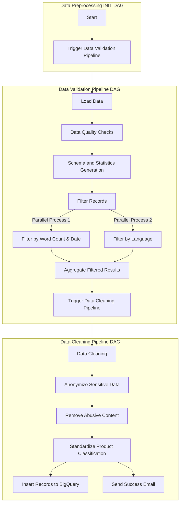

# Automated-BiLingual-Complaint-System

## Project Overview
This project implements an automated system for handling customer complaints in the banking domain. Leveraging machine learning, the system analyzes complaints submitted in two languages (English & Hindi), and categorizes them using two distinct classifiers. The first classifier identifies the banking product related to the complaint (e.g., credit card, loan, account services), while the second routes the complaint to the appropriate department for efficient resolution. This solution streamlines complaint management, enhances response times, and significantly improves customer satisfaction by ensuring complaints are swiftly directed to the relevant teams.

Key features include:
- Simplified UI for complaint submission.
- Support for two languages (English, & Hindi).
- Automatic classification of products and departments using machine learning.
- Agent assignment based on language proficiency and availability.

## Project Setup

### Prerequisites
- Ensure you have **Docker** installed.
- Ensure you have **Visual Studio Code** installed.
- Allocate sufficient resources to Docker (e.g., memory, CPU) to ensure the project runs smoothly.
- GCP Project setup (We provide details below)

### Step-by-Step Project Setup Guide

#### Step 1: Clone the Repository
Clone the repository to your local machine and navigate into the project directory:
```bash
git clone https://github.com/rajpandeygithub/Automated-BiLingual-Complaint-System.git
cd Automated-BiLingual-Complaint-System
```

#### Step 2: Open the Project in Visual Studio Code or any local termnial app
Open the project folder (`Automated-BiLingual-Complaint-System`)

## Project Architecture


---

### Data Preprocessing Setup
The Data Preprocessing Pipeline built using `AirFlow` and is present as an Directed Acyclic Graph. All necessary libraries are listed in the `requirements.txt` file. This file is also used in the `docker-compose.yaml` setup to ensure all dependencies are installed when running the project.

The following are the steps to start the data preprocessing pipeline:

#### Step 1: Initialize Docker Compose:

```bash 
cd data_preprocessing_pipeline/
```

1. Initialize Airflow:
```bash
docker compose up airflow-init
```
2. Start all containers:
```bash
docker compose up
```

#### Step 2: Access the Airflow Web Interface
Once the containers are up and running, open your browser and go to:
```
http://localhost:8080/home
```
Login with default username password:

**Username: airflow**

**Password: airflow**

#### Step 3: Enable and Run DAGs

In the Airflow web interface:
1. Enable the toggles for all DAGs to activate them.
2. **First-time Setup**: If this is your first time running the DAGs, they should start automatically.


3. **Subsequent Runs**: If the DAGs have been run before, trigger the `Data_Preprocessing_INIT` DAG **manually**. This will initiate a sequence:
   - `Data_Preprocessing_INIT` will trigger `Data_Validation_Pipeline`, which will, in turn, trigger the `Data_Cleaning_Pipeline`.


#### Step 4: Shut Down Docker Containers
To stop and shut down the Docker containers, go to the terminal and run:
```bash
docker compose down
```
\
Next, we build the solution on Google Cloud Platform (GCP) so we recommend GCP for reproducability.

### GCP Setup Steps:
---

### **1. Create a GCP Project**
- Go to [Google Cloud Console](https://console.cloud.google.com/).
- Create a new project:
  - **Project ID**: Choose a unique name for your project (e.g., `my-project-name`).
  - **Location**: Choose `us-east1` or your preferred location.
  - **Setup a Billing Account** in GCP.
- **Note**: Save your Project ID and Location, as it will be needed to update configuration files.

---

### **2. Create a Slack Webhook URL**
- Create an **Incoming Webhook** in your Slack workspace to receive notifications.
- Save the generated Slack webhook URL.

---

### **3. Store Secrets in GitHub**
- Go to your repository on GitHub and navigate to **Settings > Secrets and Variables > Actions**.
- Add the following secrets:
  - **Slack Webhook URL**:
    - Key: `SLACK_URL`
    - Value: Paste the Slack webhook URL.
  - **GCP Service Account Key**:
    - Key: `GCP_SA_KEY`
    - Value: Paste the contents of your service account JSON file (from Step 6).

---

### **4. Enable Required APIs**
Enable the following APIs in **APIs & Services > Library** in the GCP Console:
- **Cloud Storage API**
- **AI Platform Training and Prediction API**
- **Cloud Run API**
- **Artifact Registry API**
- **Cloud Functions API**
- **Cloud Pub/Sub API**
  


---

### **5. Create a Storage Bucket and Artifact Directory**
- Go to **Cloud Storage** in the GCP Console.
- Create a bucket:
  - **Bucket Name**: `tfx-artifacts` (or a name of your choice).
  - Choose the same region as your project (e.g., `us-east1`).
- Create a directory inside the bucket:
  - **Directory Name**: `pipeline_artifacts`
  - This will be used to store pipeline artifacts.

---

### **6. Create a Service Account**
- Go to **IAM & Admin > Service Accounts** in the GCP Console.
- Create a new service account:
  - **Name**: Use a descriptive name (e.g., `pipeline-service-account`).
  - Assign the following roles:
    - **Owner**
    - **Editor**
    - **Cloud Run Admin**
    - **Artifact Registry Admin**
- Download the service account key as a JSON file.

---

### **7. Update Configuration Files**
- Replace the following in the configuration files:
  - **Project ID**:
    - Replace `bilingualcomplaint-system` with your Project ID.
  - **Region**:
    - Replace `us-east1` with your chosen location (if different).
- Files to update:
  - `.yml` files (CICD pipelines)
  - Docker configuration files.


## Data Acquisition

We make use of the Consumer Complaint Database from Consumer Financial Protection Bureau (CFPB). This database compiles real-time U.S. consumer complaints regarding financial products and services. It includes data on consumer narratives (anonymized), banking products, and company responses, providing insight into financial sector issues.

For more information: [Link](https://www.consumerfinance.gov/data-research/consumer-complaints/) <br>
For API Access: [Link](https://cfpb.github.io/api/ccdb/api.html)

### Data Schema

| Attribute Name              | Description                                                                                   | Data Type |
|-----------------------------|-----------------------------------------------------------------------------------------------|-----------|
| `entity_id`                 | Unique identifier for each complaint                                                          | Integer     |
| `feature_timestamp`         | Date when CFPB received the complaint                                                          | Datetime      |
| `date_resolved`             | Date when the complaint was resolved by the bank                                                          | Integer      |
| `time_resolved_in_days`     | Duration in days taken to resolve the complaint by the bank                                               | Integer     |
| `complaint`                 | Consumer's answer to "what happened" from the complaint. Consumers must opt-in to share their narrative. The  narrative is not published unless the consumer consents, and consumers can opt-out at any time. The CFPB takes reasonable steps to scrub personal information from each complaint that could be used to identify the consumer.                                                    | String    |
| `complaint_hindi`           | Text content of the complaint (in Hindi)                                                      | String    |
| `product`                   | The type of product the consumer identified in the complaint                       | String    |
| `department`                | The department responsible for handling the complaint                                         | String    |
| `sub_product`               | The type of sub-product the consumer identified in the complaint                                       | String    |
| `issue`                     | The issue the consumer identified in the complain                                                            | String    |
| `sub_issue`                 | The sub-issue the consumer identified in the complaint                                                             | String    |
| `company`                   | Company associated with the complaint                                                         | String    |
| `state`                     | The state of the mailing address provided by the consumer                                                   | String    |
| `zipcode`                   | The mailing ZIP code provided by the consumer                                                    | String     |
| `company_response_consumer` | This is how the company responded. For example, "Closed with explanation"                                                     | String    |
| `consumer_consent_provided` | Identifies whether the consumer opted in to publish their complaint narrative. The narrative is not published unless the consumer consents and consumers can opt-out at any time                                     | String    |
| `submitted_via`             | How the complaint was submitted to the CFPB                          | String    |
| `date_sent_to_company`      | The date when CFPB sent the complaint to the company                                 | String    |
| `timely_response`           | Whether the company gave a timely response                                 | String    |
| `consumer_disputed`         | Whether the consumer disputed the company’s response                                     | String    |

## Data Preprocessing Pipeline

The preprocessing pipeline performs comprehensive data cleaning, filtering, and anonymization on the Consumer Complaint Database from Consumer Financial Protection Bureau (CFPB). The pipeline includes multiple stages to ensure data quality and privacy. We prefer `Polars` over `Pandas` to process data faster.

### Preprocessing Steps

### 1. Data Loading
- Loads the raw dataset from Google Cloud Storage
- Dataset format: Parquet

### 2. Data Quality Checks
- We employe the following data quality checks:
- - Textual Data Validation
- - Date Field Validation
- - Numeric Field Validation
- - Categorical and Format Validation

### 3. Schema Statistics Generation
- Data Types and Casting to ensure consistency
- Categorical Feature Distribution to learn distribution
- Yearly Aggregated Statistics - unique products/departments per year
- Year-over-Year Changes: Complaint counts, Product counts, Department counts
- Finding Duplicates

### 4.a Language Detection (Parallel)
- Uses `fast_langdetect` (based on fast-text) for language identification
- Implements multi-threaded processing for improved performance
- Retains only English (EN) and Hindi (HI) complaints
- Removes records in other languages

### 4.b Remove records with minimum words & Outdated dates (Parallel)
- Removes records with insufficient word count
- Filters records based on date range (March 19, 2015 to July 28, 2024)
- Converts date fields to proper date format

### 5. Aggregate Parallel Tasks
- Joins filtered datasets on complaint ID
- Selects and maintains relevant columns


### 6 Data Preprocessing:
- Lowercasing text
- Remove Duplicates records.
- Handle Missing Values like filling null values appropriately.
- Clean specific patterns like `xxxx`, `xxxx2022`, or `abcxxxx` and replace redacted information with standard placeholder.

### 7. PII Data Anonymization
- Detects and masks personally identifiable information (PII)
- PII types handled:
  - Bank account numbers
  - Routing numbers
  - Credit card numbers (multiple formats)
  - Transaction dates
  - SSN/TIN numbers
  - EIN numbers
  - Passport numbers
  - Email addresses
  - Phone numbers
  - Home addresses
  - Demographic information (race, ethnicity, gender)
  - Transaction amounts

### 8. Abusive Content Filtering
-	Removes words from a set of abusive words
-	Implements Bloom filter for efficient filtering
-	Replaces abusive words with placeholder text
-	Processes text while maintaining sentence structure


### 9. Standardize Product labels
- Excludes records where the ‘product’ column is labeled as ‘other financial service’, as this classification is overly broad and lacks specificity.
- Standardized categories using a predefined dictionary (product_map), ensuring synonymous or similar product types are grouped under a consistent label.


### 10. Insert Into BigQuery
- Inset the clean dataset into BigQuery warehouse

### 11. Success Email Trigger
- Once all the pipelines have successfully run, a success email is triggered to notify stakeholders of the pipeline completion

### 12. Slack Alerts Integration
- On every DAG success and failure, we trigger a slack notification a private channel in the MLOps workspace.


### Output
- Final preprocessed dataset saved in Parquet format
- Location: `data/preprocessed_dataset.parquet` and `bilingualcomplaint-system.MLOps.preprocessed_data`(BigQuery)
- Includes comprehensive logging of all preprocessing steps
- Send a pipeline success / failure email


### Pipeline Orchestration (Airflow DAGs)
Summarizing entire Airflow Orchestration Graph Below:



Summarizing the entire Airflow Orchestration Graph Below Using Dags:
   
   
   
   
   


## Tracking and Logging

Our pipeline includes detailed logging to track progress and identify issues about errors during data processing. We use Python's `logging` library to set up a custom logger that captures important information at each stage of the process.

### Key Features:
- **Progress Tracking**: Logs are generated at each stage of the pipeline, including all functions.
- **Error Monitoring**: Errors are logged with relevant details, making it easier to locate and fix issues quickly.
- **Custom Log Path**: All logs are saved in `logs/application_logs/preprocessing_log.txt` for easy access and troubleshooting.


## Data Versioning with DVC
- 1. DVC (Data Version Control) to manage and version control our datasets throughout the preprocessing pipeline
- 2. Raw data is loaded from Google Cloud Storage (GCS), processed and cleaned using our Airflow pipeline, and the preprocessed data is then stored back to 
- 3. Metadata versions are stored in GCS
     
 
  


## Pipeline Flow Optimization
- In Filter by Language task, Multi-threading was used to detect the language of the text in parallel. Before multi-threading the time to complete language detection was 3.43 seconds, and after multi-threading the execution time was reduced to 2.28 seconds.
- In Remove Abuse content task, we have a list of abusive words to remove. So to efficiently remove abusive words we made use of Bloom Filters. This reduced our execution time from 1.25 to 1.65 seconds.

Below is the Gantt chart illustrating the pipeline flow after optimization:

   
   
   
   
   
   
   
   
   
   
   


## Data Schema & Statistics Generation: 

Here's a high-level overview of what are the steps we do in the context of feeding quality data to the modelling stage.

### 1. Data Quality Assurance
- **Text Validation:** Perform several checks on consumer complaint narratives to ensure data quality, as the quality of data directly impacts the performance of text classification models. The following issues are validated:
   - Empty Entries: Checked for any entries that lack text.
   - Extremely Short or Long Complaints: Complaints that are too short or excessively long are flagged for review.
   - Non-ASCII Characters: Identified any characters that fall outside the standard ASCII range.

- **Interdependent Constraint Validation:** Checked for logical consistency between related fields. This step helps maintain the overall quality of the dataset by ensuring that related data points align correctly.

- **Categorical Data Validation:** Verified that categorical values (some of which serve as output labels) contain valid entries. This ensures that the model is trained on appropriate and meaningful labels.
  
### 2. Statistics Generation and Schema Analysis

- **Data Statistics Generation:** Generating comprehensive statistics from the DataFrame containing complaint data using TensorFlow Data Validation (TFDV). These statistics offer insights into the distribution and characteristics of the data, serving as a foundational reference for quality assessment.
  
- **Outlier Detection:** Identified unusually long complaints that could skew the classification model or indicate special cases needing separate handling.
  
- **Class Distribution Analysis:** Examined the distribution of complaints across different categories (e.g., products, issues). Understanding class imbalance is vital, as it may require techniques like oversampling or undersampling to ensure effective model training.

- **Temporal Analysis:** Analyzed yearly trends in complaint volumes and categories. This information can be leveraged to create time-based features and understand whether the classification model needs to account for temporal shifts in complaint patterns.

- **Duplicate Detection:** Identified repeated complaints to prevent data leakage and ensure that the classification model does not overfit to duplicated data.

- Finally, we remove `tags` and `company_response_public` columns as they had `99%` null values from TFDV library.

## Anomaly Detection & Alerts

Incorporated a comprehensive data quality assessment and anomaly detection process tailored for consumer complaint data ensuring that our data meets predefined quality standards. 

### 1. Anomaly Detection

- **Schema Inference:** Inferred a schema from the generated statistics, defining the expected data structure, types, and constraints. This schema acts as a reference for validating incoming datasets against established business rules.
  
- **Anomaly Detection:** Checked for anomalies in the dataset by validating it against the inferred schema. It filters specific columns that we're interested in (e.g., complaint details, department, product) to focus on critical areas, logging any detected issues.


  
- **Anomaly Resolution:** To fix the detected anomalies, relaxed the minimum and maximum fraction constraints for values that must come from the domain for the features where anomalies were identified. This adjustment allowed us to accommodate legitimate data variations.

- **Schema Freezing:** Once the anomalies were fixed, inferred a schema that defined the expected data structure, types, and constraints. We then "froze" this schema and stored it in a file, creating a consistent reference point for validating incoming data when our application is released to the public. Freezing the schema is crucial as it ensures that any data processed in production adheres to the established rules and standards, helping us maintain high data quality and reliability.

### 2. Alerts

- **Alerts for Anomalies:** To ensure prompt communication, alerts were generated and sent via email whenever anomalies were detected in the data. This proactive approach allowed us to stay informed and address / fix potential anomalies swiftly.


## CI-CD

### a. Data Source

- Data is fetched in TFRecord format from the provided train_data path.
- The primary feature (feature) represents tokenized text, and the target label (label) corresponds to the classification category.
- A TFRecord parsing function converts the data into TensorFlow-compatible format.


### b. Model

The pipeline now integrates a Hugging Face model for sequence classification:
- Hugging Face Pretrained Model: Defaulting to bert-base-multilingual-cased.
- Architecture: Fine-tunes the Hugging Face transformer using TensorFlow.

Key Model Features:
- Customizable Parameters:
- max_epochs: Default of 2.
- batch_size: Default of 8.
- max_sequence_length: Default of 128 tokens.
- Training Strategy:
	- Dataset split into training and validation subsets (default split ratio: 80/20).
	- Batch processing and shuffling for efficient training.

### c. Model Components

# Bilingual Complaint System - ML Pipeline

This repository implements a machine learning pipeline for processing bilingual complaint data and training a multilingual BERT model for classification. The pipeline uses Google Cloud BigQuery for data extraction, TensorFlow for model training, and Google Cloud AI Platform for model deployment and testing.

## Components

## 1. 'get_data_component'
This component fetches data from Google BigQuery, processes it, and splits it into training and validation sets. It also sends notifications via email and Slack about the status of the pipeline.

### Key Features:
- Fetches data from Google BigQuery using a custom SQL query.
- Performs label encoding on product categories.
- Splits data into training and validation datasets.
- Sends a success or failure email based on the outcome.
- Sends execution details to Slack for monitoring.

---

## 2. 'prepare_data_component'
This component prepares the data for training by converting the text into a format suitable for BERT-based models using TensorFlow. It tokenizes the text and serializes the data into TensorFlow records.

### Key Features:
- Loads the preprocessed data.
- Tokenizes the text using Hugging Face's BERT tokenizer.
- Creates a TensorFlow dataset and saves it in TFRecord format.

---

## 3. 'train_mbert_model'
This component trains a multilingual BERT model for sequence classification using TensorFlow. It prepares the data, configures the model, and saves the trained model.

---

### 4. 'test_mbert_model`
The **Model Testing Component** evaluates the performance of the trained M-BERT model using a test dataset and computes key classification metrics.

#### Key Operations:
1. Loads the test dataset and parses it.
2. Loads the trained M-BERT model.
3. Makes predictions on the test data.
4. Computes metrics such as precision, recall, and F1 score.
5. Saves the metrics to a file and sends a Slack notification with the results.

---

### 5. 'log_metrics_to_vertex_ai '
This component logs metrics to Vertex AI for tracking and monitoring machine learning model performance. It reads the metrics from an input artifact (a JSON file) and logs them to Vertex AI.

## Purpose

This component is designed to streamline the process of logging key metrics from machine learning experiments or models to Vertex AI. This helps teams monitor model performance and experiment results in a centralized location on Google Cloud.

## Key Actions:
- **Metrics Logging**: Logs metrics such as accuracy, loss, precision, etc., to a Vertex AI run.
- **Experiment Tracking**: Associates the metrics with a specific experiment for future reference.
- **Run Management**: Starts and ends a run to ensure that metrics are recorded with timestamps and contextual information.

---

### 6. 'bias_detection'
The **Bias Detection Component** evaluates the fairness of the trained M-BERT model across different groups, using Fairlearn to calculate metrics like true positive rate, false positive rate, and selection rate.

#### Key Operations:
1. Loads the test dataset and parses it.
2. Loads the trained M-BERT model.
3. Makes predictions on the test data.
4. Computes fairness metrics using Fairlearn.
5. Detects bias by comparing the performance across different groups.
6. Sends an alert to Slack with the bias detection results.

---

### 7. 'model_registration'

The **model registration** component is responsible for uploading and registering models to Vertex AI. It checks if a model with the same display name already exists, and if so, it adds a new version under the existing model. If no model exists, it creates a new model in Vertex AI.

#### Key Actions:
- **Model Upload**: Uploads the model artifact (e.g., trained model file) to Vertex AI for registration.
- **Versioning**: If a model with the same display name exists, it creates a new version under the existing model. Otherwise, it creates a new model.
- **Serving Configuration**: Uses a predefined TensorFlow serving container image for deployment.

---

### 8. 'model_deployment'

The **model deployment** component deploys the registered model to a Vertex AI endpoint. It also handles notifications to team members via email and Slack, providing updates on the success or failure of the deployment process. The component ensures model deployment scalability by setting up traffic splitting and replica counts.

#### Key Actions:
- **Model Deployment**: Deploys the registered model to an existing or new Vertex AI endpoint.
- **Endpoint Management**: Checks for an existing endpoint; if none exists, it creates a new one.
- **Traffic Distribution**: Configures traffic to the deployed model with a specified split between models if necessary.
- **Notification**: Sends notifications to a list of recipients via email and Slack, reporting deployment success or failure.

---


### d. Model Evaluation

Metrics:
- Accuracy: Measures the percentage of correct predictions.
- Loss: Monitored for both training and validation datasets during training.

Callbacks:
- Early Stopping: Halts training if the validation loss doesn’t improve after 3 epochs.
- ReduceLROnPlateau: Reduces the learning rate by a factor of 0.1 when the validation loss plateaus.

### e. Model Deployment

- Model Output:
	- Trained model saved in the specified directory under the model_output path.
	- Supports direct reloading via TensorFlow for inference or additional fine-tuning.
- Slack Integration:
	- Can be integrated with Slack for real-time notifications on training progress, errors, and completion.
- Monitoring:
	- Validation loss monitored via callbacks to ensure early detection of overfitting or underperformance.

### f. Monitoring and Notifications
- Slack Integration: Sends real-time notifications for each pipeline execution stage, ensuring immediate updates on success or failure.
- BigQuery Tracking: Logs metrics and metadata, such as training duration, model performance, and record counts, for centralized analysis.

### g. Automation
- Pipeline Compilation: The entire machine learning workflow is compiled using Kubeflow and Vertex AI.
- End-to-End Automation: Submitting the pipeline to Vertex AI automates data preprocessing, model training, evaluation, registration, and deployment, streamlining the entire lifecycle.

### h. Bias Detection
- Implements checks for model bias by analyzing predictions across different subsets of data (e.g., categories, demographics, or product types) to ensure fairness.

### Model Pipeline:


### Model Registry:


### Cloud Run function:


## Data Drift Detection

Data drift refers to changes in the statistical properties of data over time, which can affect the performance of machine learning models. To address this, we track data drift in the **The Automated BiLingual Complaint System** implements a robust mechanism to monitor data drift, leveraging advanced NLP techniques and cloud infrastructure. Below, we describe each component in detail.

**Cosine Similarity Analysis**:  
To monitor data drift, we compare incoming complaint data with a reference dataset using cosine similarity. This process helps identify whether new complaints deviate significantly from the patterns in historical data. The steps involved are:

- **Sentence Embeddings**: Each complaint (in English or Hindi) is converted into a high-dimensional vector representation using a pre-trained model 'MiniLM-L12-v2' to generate english embeddings and 'paraphrase-multilingual-MiniLM-L12-v2' to generate hindi embeddings.This embedding captures the semantic meaning of the text, enabling us to analyze similarities at a deeper level than keyword matching.

- **Reference Dataset**: A historical dataset of complaints (baseline data/reference embeddings) is maintained, representing typical complaints that the system has been trained on or encountered in the past. These embeddings are stored in a pickel file in Google Cloud Storage Bucket and is picked up from the cloud function through this path.

- **Cosine Similarity Calculation**: The cosine similarity between each new complaint and the reference dataset is computed. Cosine similarity measures the angular distance between two vectors, providing a score between -1 (completely dissimilar) and 1 (identical).
A threshold (e.g., 0.55) is defined to detect drift in case of english embeddings, whereas a threshold of (e.g. , 0.7) is used for hindi text drift detection. If the maximum cosine similarity score for a new complaint falls below this threshold, it indicates significant deviation, and the complaint is flagged as "drifted."

- **Most Similar Complaint Identification**: For each incoming complaint, the system identifies the most similar complaint in the reference dataset and logs it along with the similarity score. This provides insight into whether the complaint is a slight variation of an existing pattern or entirely new.


**Drift Records in BigQuery**:  
  Drift events are logged in a BigQuery table, capturing details like:
  - Timestamp of the event.
  - Complaint text in English and Hindi.
  - Product and department classifications.
  - Maximum cosine similarity score.

 

 ## Data Bias Detection and Mitigation

The project routes customer complaints to the correct product and department based solely on complaint narratives, with demographic or personally identifiable information (PII) redacted to ensure privacy and mitigate demographic bias. This approach aligns with responsible ML fairness principles, ensuring that the model is not biased on demographic factors like location, gender, religion, ethnicity etc. 


### 1. Detecting Bias in Data: 
- We evaluate model fairness across complaint-related categories, focusing on product, department, to detect performance imbalances. We’ll record each type of bias discovered, the slice affected, and the metrics indicating bias. The bias mitigation technique will be documented with explanations, parameters used, any trade-offs and reasoning.
 
### 2. Data Slicing: 
- We will use Fairlearn's MetricFrame to define and evaluate slices of data once predictions are available. MetricFrame enables us to track performance across slices and detect bias by calculating metrics like accuracy etc for each slice. 

### 3. Bias Mitigation: 
If significant discrepancies appear across slices:
- Re-sampling Underrepresented Groups: If some slices have fewer instances, we’ll balance them by oversampling (duplicating underrepresented entries) or under-sampling (reducing overrepresented entries). 

- Once the ML model is built, fairness constraints through Fairlearn can be applied to optimize for balanced performance across slices, ensuring no slice disproportionately affects routing accuracy. 

- For certain slices, we may apply customized decision thresholds to improve performance for groups with historically lower accuracy.

## Preprocessing Module Unit Tests
- Unit tests have been developed to validate the functions in `preprocessing.py`, covering data loading, record filtering, language detection, abusive content removal, and data aggregation processes.
- These tests ensure correct data transformation and filtering logic is applied to meet preprocessing requirements.

## Experimentation

### Vertex AI
- The entire machine learning pipeline is orchestrated using Vertex AI Pipelines.
  
Key components of the pipeline include:
- Data Ingestion: Fetching data from BigQuery and preprocessing it.
- Model Training and Testing: Using XGBoost and Naive Bayes models for complaint classification.
- Model Selection and Registration: Choosing the best-performing model based on evaluation metrics and registering it in Vertex AI for deployment.


The **Automated BiLingual Complaint System** uses two models for classification tasks. 

### 1. mBERT Model
The mBERT model was used to classify complaints into appropriate **Departments** and **Products**, ensuring efficient complaint routing and resolution.

#### Department Classification
Classifies complaints into relevant organizational departments for faster resolution.  
- **Overall F1 Score**: 0.55  
- **Precision**: 0.62, **Recall**: 0.55  
- Departments with at least 468 complaints:
  - Fraud & Security  
  - Loans & Credit  
  - Payments & Transactions  
  - Customer Relations & Compliance  
  - Account Services  


#### Product Classification
Identifies the product category associated with a complaint for targeted handling.  
- **Overall F1 Score**: 0.69  
- **Precision**: 0.70, **Recall**: 0.69  
- Products with at least 681 complaints:
  - Credit/Debt Management & Repair Services  
  - Vehicle Loan  
  - Credit/Prepaid Card Services  
  - Money Transfers  
  - Mortgage  
  - Checking or Savings Account  


## 2.XLM-RoBERTa Model
The XLM-RoBERTa model is used as an alternative for classifying complaints into Departments and Products. This multilingual model leverages state-of-the-art transformer-based architecture to handle bilingual data efficiently

### Department Classification
Classifies complaints into the relevant organizational departments for streamlined resolution.

**Overall F1 Score**: 0.42
**Precision**: 0.55, **Recall**: 0.39
Departments with at least 468 complaints:
Fraud & Security
Loans & Credit
Payments & Transactions
Customer Relations & Compliance
Account Services


### Product Classification
Classifies complaints into product categories for precise issue handling.

**Overall F1 Score**: 0.68
**Precision**: 0.72, **Recall**: 0.65
Products with at least 681 complaints:
Credit/Debt Management & Repair Services
Vehicle Loan
Credit/Prepaid Card Services
Money Transfers
Mortgage
Checking or Savings Account


## Monitoring

The system leverages **Vertex AI Monitoring** for real-time tracking and visualization of key metrics, including:

- **Prediction Success Rates**: Monitors the success of department and product predictions.
- **Resource Utilization**: Tracks CPU and memory usage for deployed endpoints to ensure efficient operation.
- **Error Tracking**: Captures validation errors and anomalies for proactive troubleshooting.

Below is a snapshot of the monitoring dashboard:


## Test CICD

This pipeline runs tests to validate changes in the preprocessing script using pytest and ensures the code is correct before deployment.

---

### **Trigger Conditions**
- Runs when:
  - Code is pushed or a pull request is made.
  - Changes are detected in:
    - `data_preprocessing_pipeline/dags/scripts/preprocessing.py`
    - `tests/**`

---

### **Pipeline Steps**
1. **Checkout Repository**: Pulls the latest code from the repository.
2. **Set up Python**: Installs Python 3.12 on the runner.
3. **Cache pip**: Speeds up dependency installation by caching pip packages.
4. **Install Dependencies**:
   - Upgrades `pip`.
   - Installs packages from `requirements.txt`.
   - Installs `pytest` for running tests.
5. **Set PYTHONPATH**: Configures the Python environment to include the project directory.
6. **Run Tests**: Executes all test cases in the `tests/` directory using `pytest`.
7. **Upload Logs**:
   - **On Failure**: Uploads `pytest.log` for debugging.
   - **On Success**: Uploads `pytest.log` as a record of successful test execution.

---

### **Setup**
- Ensure all tests are added to the `tests/` directory.
- Define dependencies in `data_preprocessing_pipeline/requirements.txt`.

This pipeline ensures code changes are validated before merging.


## Training CICD
This pipeline automates ML model training. 

---

### **Trigger Conditions**
- Runs when:
  - Code is pushed to the `Dev` branch.
  - Files in the `train/` directory are updated.

---

### **Pipeline Steps**
1. **Checkout Code**: Pulls the latest repository code.
2. **Authenticate with Google Cloud**: Logs into GCP using a service account key.
3. **Setup GCP**: Configures Google Cloud for the project.
4. **Install Dependencies**: Installs Python packages from `requirements.txt`.
5. **Run Training for Department**: Executes `train-department.yml` configuration.
6. **Run Training for Product**: Executes `train-product.yml` configuration.
7. **Notify Slack**: Sends updates using the provided webhook.

---

### **Setup**
- Add GCP credentials (`GCP_SA_KEY`) and Slack webhook (`SLACK_URL`) as repository secrets.


## Deployment CICD
This pipeline automates deploying trained ML models.

---

### **Trigger Conditions**
- Runs when:
  - Code is pushed to the `Dev` branch.
  - Files in the `deployment/` directory are updated.

---

### **Pipeline Steps**
1. **Checkout Code**: Pulls the latest repository code.
2. **Authenticate with Google Cloud**: Logs into GCP using a service account key.
3. **Setup GCP**: Configures Google Cloud for the project.
4. **Install Dependencies**: Installs Python packages from `deployment_requirements.txt`.
5. **Run Deployment for Department**: Executes `deployment_pipeline.py` with `department.yml`.
6. **Run Deployment for Product**: Executes `deployment_pipeline.py` with `product.yml`.

---

### **Setup**
- Add GCP credentials (`GCP_SA_KEY`) as a repository secret.


## Backend CICD
This pipeline automates the deployment of the FastAPI backend to Google Cloud Run.

---

### **Trigger Conditions**
- Runs when:
  - Code is pushed to the `Dev` branch.
  - Files in the `backend/` directory are updated.

---

### **Pipeline Steps**
1. **Checkout Code**: Pulls the latest repository code.
2. **Google Cloud Authentication**: Authenticates with GCP using a service account key.
3. **Docker Authentication**: Logs into Google Artifact Registry for pushing Docker images.
4. **Build and Push Docker Image**: 
   - Builds a Docker image for the FastAPI backend.
   - Pushes the image to Google Artifact Registry.
5. **Deploy to Cloud Run**: Deploys the Docker image to Google Cloud Run with specified memory and region.
6. **Show Output**: Displays the deployed Cloud Run service URL.

---

### **Setup**
- Add GCP credentials (`BACKEND_DEPLOY_CLOUD_RUN`) as a repository secret.


## Frontend CICD
This pipeline automates the deployment of the frontend application to Google Cloud Run.

---

### **Trigger Conditions**
- Runs when:
  - Code is pushed to the `Dev` branch.
  - Files in the `frontend/` directory are updated.

---

### **Pipeline Steps**
1. **Checkout Code**: Pulls the latest repository code.
2. **Google Cloud Authentication**: Authenticates with GCP using a service account key.
3. **Docker Authentication**: Logs into Google Artifact Registry for pushing Docker images.
4. **Build and Push Docker Image**: 
   - Builds a Docker image for the frontend.
   - Pushes the image to Google Artifact Registry.
5. **Deploy to Cloud Run**: Deploys the Docker image to Google Cloud Run in the specified region.
6. **Allow Unauthenticated Access**: Grants public access to the deployed service.
7. **Show Output**: Displays the deployed Cloud Run service URL.

---

### **Setup**
- Add GCP credentials (`BACKEND_DEPLOY_CLOUD_RUN`) as a repository secret.


## User Interaction

The **Customer Complaint Portal** allows users to submit complaints, validate inputs, and receive feedback about their concerns. Below is an example of the portal in action:

### 1. Homepage
The homepage provides a homepage for users to get an overview of the project.


### 2. Complaint Submission
It provides a simple interface for users to begin submitting their complaints. Users are greeted with the title and a text area for input.
Users can type their complaints in the provided text area. For example, here's a complaint involving a credit card issue:


### 3. Complaint Resolution
After submitting, the system processes the complaint and assigns it to the relevant department or product owner. A success message is displayed along with the assignment details.


## Backend API

The backend of the **Bilingual Complaint Classification System** is powered by **FastAPI** and deployed on **Google Cloud Run**. It serves as the core processing engine for complaint classification, exposing endpoints for submitting complaints and predicting the relevant department and product.

Features:
- **Complaint Validation:** Ensures complaints meet language and content criteria.
- **Data Preprocessing:** Cleans and prepares complaint text for analysis.
- **Drift Detection:** Identifies deviations in complaint data distribution.
- **Machine Learning Predictions:** Classifies complaints into product and department categories using Vertex AI.
- **Data Storage:** Stores processed complaints and predictions in BigQuery.
- **Logging and Monitoring:** Captures application events and errors using Google Cloud Logging.

### API Documentation
The API is documented using **OpenAPI** standards, providing an interactive interface for testing and exploring available endpoints. Below is a snapshot of the `/docs` page:


The key endpoints include:
- **GET `/ping`**: A health check endpoint to ensure the backend is running.
- **POST `/predict`**: Accepts a complaint and returns the predicted department and product classification.

## License Information

The Consumer Financial Protection Bureau (CFPB) data is open to the public under the OPEN Government Data Act, enabling transparency and broad accessibility. Users should follow privacy guidelines, particularly around any personally identifiable information (PII) within consumer data.

For further details, refer to the [CFPB Data Policy](https://www.consumerfinance.gov/data/).
